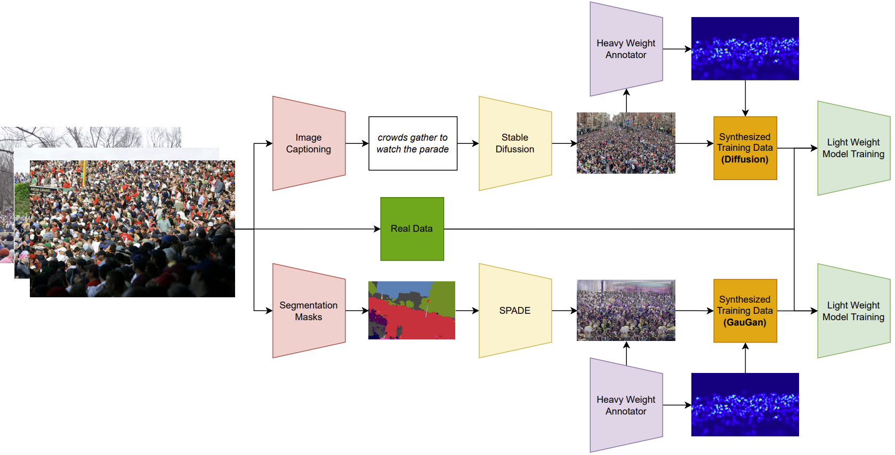
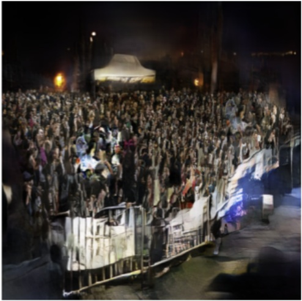

# Using Generated Images to Improve Crowd Counting
In today’s world, computer vision is becoming ever more prominent. In the world of crowd counting, models have seen a large increase in performance in recent years, following a general trend of increasing the size of the models. 

Even though such heavyweight models perform very well, the computational resources they require to make a single prediction make them infeasible for many cases of deployment, as they will be too slow to work in real-time applications. Lightweight models may be deployed on IoT devices and in smart cities, yet their smaller size means they perform much worse than their state-of-the-art heavyweight counterparts. Due to a range of complexities such as inconsistent perspectives, scale variation, and occlusion, they achieve less accurate results. 

Because of these complications, a particular limiting factor is the lack of availability of large, diverse datasets with accurate annotations for training deep learning models. Obtaining more data is a very time-consuming and difficult task. Instead, many people have tried several techniques to boost the quality and size of the available training data. Such techniques include data augmentation, environment simulations, using graphical/game engines, and generating synthetic data. 

This paper will present one such technique, building on the PromptMix method to be introduced later. First, it will present related work to the subject at hand, whereafter it will present the methods used to boost datasets. The next section will describe the experimental setups for obtaining the results, which will be introduced and discussed in the section thereafter. Finally, we will conclude upon these results, and present possible future work.

## Figures 

### Pipeline overview
Abstract overview of the pipeline used to generate images

### Example of image generation
A single example of an image generated by GauGAN including the input image

